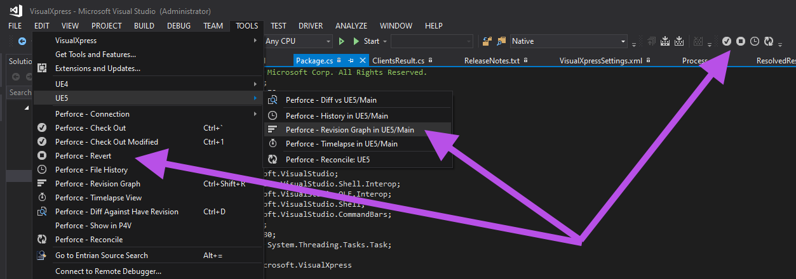
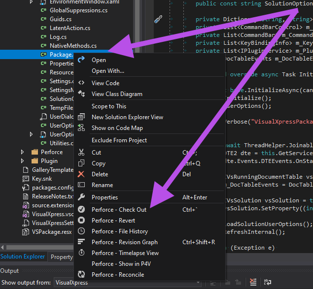
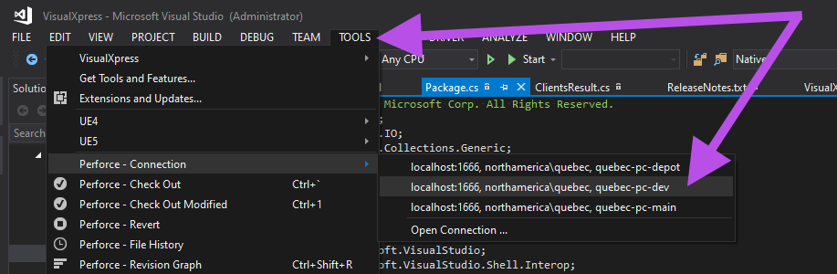
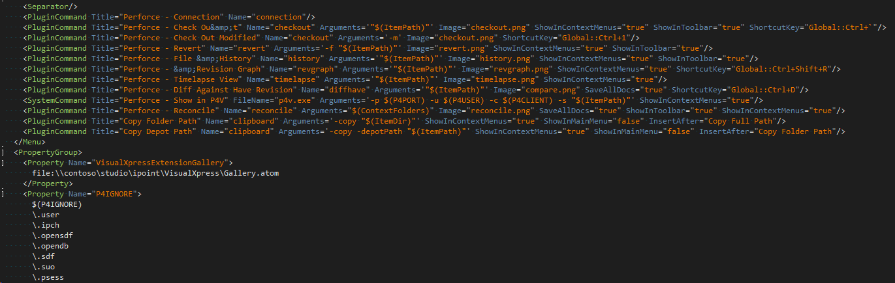
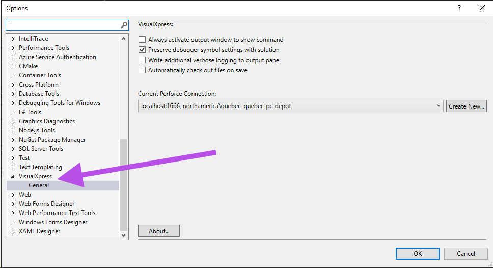
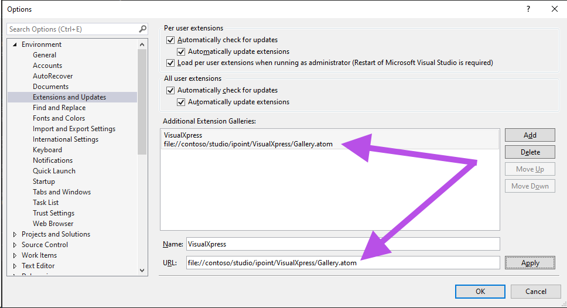

# Introduction 

VisualXpress is a Visual Studio extension used easily integrate external tools into the IDE. You can think of it as the Visual Studio External Tools customization as it really should be!

* Useful global external tools definitions included
* User external tools definitions configurable locally
* Custom tools with icons in toolbar, main menus, and context menus
* Tools as menu items anywhere within visual studio menus and tabs configurable from XML
* Custom plugin implemented tools in addition to external system applications
* Completely temporary VS commands that will not exist after package uninstall
* Hot-reload VisualXpress updates to Visual Studio! (no restarts)
* Extension compatible with VS 2017, 2019, 2022
* Define keyboard shortcuts to any of the commands from the XML
		
# Perforce integration commands

* Checkout and Revert works properly with P4CONFIG 
* Global P4 config switching on the fly
* Reconcile entire solution with similar P4IGNORE functionality in addition to regular expressions as well!
* Diff your current file against any perforce revision in any depot… using your own diff tool (as defined by your own p4v settings)!
* Show the history of the file from p4v

# Deployment and build customization

* Setup a private gallery for your team to install and auto-update.
* Very easy to extend, build, debug, test and deploy for developers! 
* Extensive MsBuild project customization has gone into making VisualXpress extremely easy to build, test, and deploy against multiply VS versions. 
* Easy version changes, auto-install and publish to gallery in custom build configurations

# Installation

* VisualXpress for Visual Studio extension can be installed from running the VisualXpress vsix after building. The *staging* folder with the private Gallery.atom feeds can be copied to a network share for team deployment and auto-updating.
```
intermediate\
   staging\
      2017\
         VisualXpress.2017.vsix
      2019\
         VisualXpress.2019.vsix
      2022\
         VisualXpress.2022.vsix
```		

# Screenshots

* Custom menus, toolbars, and commands!

  
	
* Custom Right-Click context menus!

  
	
* Nested menus, separators, switch perforce global configurations on the fly or use just P4CONFIG. Hot reload with "Refresh"

  
	
* Fully customizable locally in XML. Add new menus, plugin commands, system commands. Both user and global settings available. Hot-reloading of new XML tool definitions!

  

* Options panel for some common settings

  

* Add and update using a private extension gallery

  

# Development
	
* VisualXpress was originally created by [@jessk-msft](https://github.com/jessk-msft). Since then, many people have also participated in the development. Anyone interested is encouraged to help out!

* It's easy to get started developing new features if you'd like!

* You can then open VisualXpress.sln and build the project using VS 2022. Any Visual Studio Extension SDK requirements for other target version are included as Nuget package references, so you don't need VS 2019 & 2017 installed to build VisualXpress compatible with 2019 & 2017.
	
* VisualXpress.sln has custom project configurations and a PostBuild tool which handles installation and/or deployment.
	
* Generally build the Debug-Install or Release-Install configuration. You'll need to uninstall VisualXpress extension in Visual Studio BEFORE you load the solution. Then when you build Debug-Install config, you can F5 debug VisualXpress in a new instance of Visual Studio. Otherwise... the binaries will be locked and the install will fail (which will be obvious)

# Building and Debugging

1. Create a new (Desktop) shortcut to launch and "Experimental Instance" Visual Studio 2022
   Set shortcut target to:

   devenv.exe /rootsuffix exp

1. Launch Visual Studio using that shortcut. First time you may want to import your custom settings. This instance of Visual Studio should NOT have the VisualXpress extension installed.

1. Open the VisualXpress.sln solution file.

1. Typically iterate and build the "Debug-Update" configuration. The PostBuild step will update the currently installed VisualXpress extension for the regular "non-experimental" instance of VS.
   
1. Debug Visual Studio 2022 using executable: 

   devenv.exe


